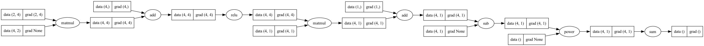

# 🧠 MiniGrad

_A minimal PyTorch-like deep learning framework built from scratch for learning purposes._

---

## 🚀 Features Implemented So Far

- **Core Tensor**

  - Wraps around `numpy.ndarray`
  - Supports autograd (automatic differentiation)
  - Builds computation graph dynamically
  - Basic operations: `+`, `-`, `*`, `/`, `@`, `exp`, `pow`, transpose, etc.
  - Supports broadcasting in forward and backward passes

- **Autograd Engine**

  - Tracks operations to build computation graph
  - Reverse-mode differentiation (backpropagation)
  - Topological sorting for gradient propagation
  - 🔍 `build_graph()` to visualize computation graph

- **Neural Network Building Blocks**

  - `Tensor` with `.backward()`
  - `Parameter` wrapper for learnable weights
  - `Module` base class (like `nn.Module` in PyTorch)
  - Layers implemented:
    - `Linear` (fully connected layer)
    - `Dropout` (training regularization)
    - Activation functions (`ReLU`, `Sigmoid`, etc.) in **functional API**

- **Optimizers**

  - `SGD` (Stochastic Gradient Descent) with learning rate

- **Losses**
  - MSE (`(y_pred - y_true) ** 2`)

## 🛠️ Installation

```bash
git clone https://github.com/yourusername/minigrad.git
cd minigrad
pip install numpy graphviz
```

🔍 Visualizing the Computation Graph
from minigrad.torch.tensor import Tensor
from minigrad.torch.utils import build_graph

## Example: simple computation

a = Tensor([2.0], requires_grad=True)
b = Tensor([3.0], requires_grad=True)
c = a \* b + a
d = c.exp()

## Build and save graph

```bash

dot = build_graph(d)
dot.render("graph", format="png")  # saves graph.png
```

Output graph example:

a ----\
 Mul ---> c ----> Exp ---> d
b ----/

## 🎯 Learning Goals

This project is for educational purposes only.
By building minigrad, you will learn:

How autograd engines work under the hood

How backpropagation computes gradients

How neural network layers, modules, and parameters are structured

How optimizers update weights

How frameworks like PyTorch/TensorFlow work internally

## 📌 Next Steps

Implement more layers (Conv2D, BatchNorm, etc.)

Add more optimizers (Adam, RMSProp, etc.)

Expand losses (CrossEntropyLoss)

Add dataset utilities (DataLoader)

Improve computation graph visualization

💡 This project is a playground to understand deep learning frameworks from scratch. Use it to build intuition before diving into PyTorch or TensorFlow!

## 🖼️ Computation Graph Preview


